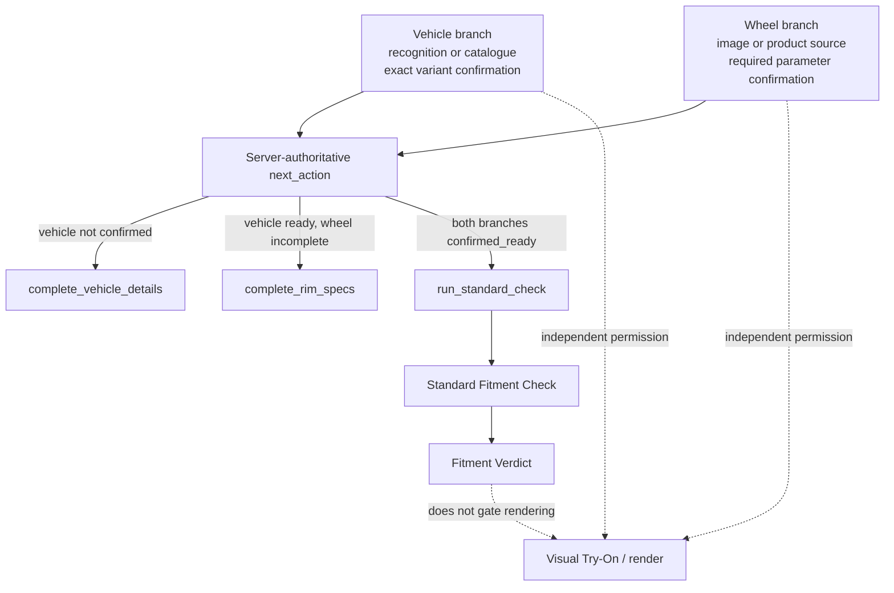

# Fitment VNext State Machine

**Status:** Frozen for VNext implementation
**Scope:** Technical Fitment UX and state contract

## Core principles

- Vehicle and Wheel are independent readiness domains.
- Visual Try-On remains independent from Technical Fitment:
  `FITMENT_VERDICT != RENDER_PERMISSION`.
- The backend owns `next_action`. The client displays and follows it; it does
  not infer the next workflow step from local form values.
- Browser drafts are a convenience. A draft whose revision baseline differs
  from the current server state is discarded in full; the fresh server state
  becomes the new baseline.

## State ownership

| Domain | Authoritative state | Meaning |
| --- | --- | --- |
| Vehicle | `vehicle_state` | State of the canonical vehicle identity and its confirmation |
| Wheel | `rim_setup_state` | State of the canonical wheel setup and its confirmation |
| Workflow | `next_action` | The single server-selected action required next |
| Technical result | Standard Fitment Check and its verdict | Evaluation of a saved, confirmed snapshot |
| Visual render | Existing render permission and flow | Independent from Fitment readiness and verdict |

## Readiness and progression

The vehicle branch saves the base identity before exact provider variant lookup
and confirmation. Provider body, generation and modification values remain
variant context; they are not separate free-form inputs before variant choice.

The wheel branch is ready only when every mandatory parameter is saved and
confirmed for each effective axle: bolt count, PCD, diameter, width, ET and DIA.
Optional load and fastener data do not add a prerequisite. Missing evidence in
provider references may still produce an `unknown` verdict after a check is
allowed.

## Invariants

- Confirming the wheel alone does not confirm or revise the canonical vehicle.
- A new Standard Check is admitted only when the vehicle and exact variant are
  ready and all mandatory wheel parameters are confirmed.
- Check evaluation uses the saved server snapshot. Its verdict semantics and
  historical results are unchanged by this workflow contract.
- Creating a visual image remains available independently of Fitment readiness,
  the check result and the verdict.
